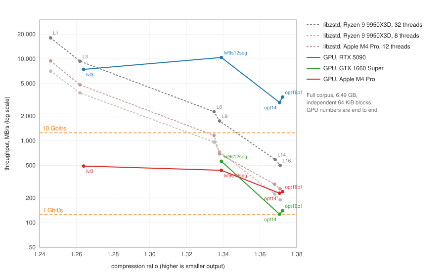

# gpu-zstd-comp

A zstd compressor that runs on the GPU. It is written in Rust, with compute shaders in WGSL, on
top of wgpu, which runs on Vulkan and Metal. The input is cut into independent 64 KiB blocks, and
the GPU turns each block into one standard zstd frame. Every frame decodes with stock libzstd; no
custom decoder is needed.

It was built to recompress Skyrim mod data, mostly DDS textures with some NIF meshes, while it
downloads. The goal is to keep up with a 1–10 Gbit/s connection on a normal gaming PC and still
match the compression ratio of high zstd levels. Decompression is out of scope; libzstd does
that.

## Why 64 KiB blocks

Every block is compressed on its own, with no references into other blocks. That lets a virtual
file system (VFS) decompress any 64 KiB of a file without touching the rest, and lets thousands
of blocks be compressed in parallel on a GPU. Smaller blocks stream better but compress worse,
because each block starts with no history. 64 KiB is our trade-off: small enough for streaming
reads through a VFS, and large enough to stay close to whole-file ratios. All numbers here are for
64 KiB blocks.

## Performance

The test set is 6.49 GB of DDS and NIF files from two texture mods, split into 100,754 blocks. The
GPU figures are end to end: upload, compression and readback of finished frames. Every GPU run was
decoded with libzstd and checked against the input.



At matching compression ratios, the GPU presets compare with libzstd on a Ryzen 9 9950X3D
(16 cores) like this:

| Ratio class | GPU preset | RTX 5090 | GTX 1660 Super | libzstd, 8 threads | libzstd, 32 threads |
|---|---|---:|---:|---:|---:|
| zstd level 3 | `lvl3` | 7,447 MB/s | – | 3,841 MB/s | 9,360 MB/s |
| zstd level 9 | `lvl9s12seg` | 10,396 MB/s | 562 MB/s | 731 MB/s | 1,747 MB/s |
| zstd level 14 | `opt14` | 2,936 MB/s | 127 MB/s | 224 MB/s | 590 MB/s |
| zstd level 16 | `opt16p1` | 3,416 MB/s | 140 MB/s | 190 MB/s | 501 MB/s |

- **Level 9 ratio:** `lvl9s12seg` on an RTX 5090 runs 6× faster than libzstd on all 32 threads,
  and 14× faster than 8 threads.
- **Level 16 ratio:** `opt16p1` beats libzstd level 16's ratio (1.37229 against 1.37100). It runs
  6.8× faster than 32 threads and 18× faster than 8.
- **On a GTX 1660 Super**, a common budget card, `opt16p1` still clears 1 Gbit/s at level-16
  ratio.
- **On an Apple M4 Pro**, the GPU is slower than the M4 Pro's own 12 CPU cores at every level.
  Running GPU and CPU side by side gave about 40 % more throughput than the CPU alone.

Per-machine details are in `docs/results/`.

## Making it fast on a GPU

What runs where:

- **The GPU does all the compression work.** Match finding (K1, K2), parsing (K3), sequence
  entropy coding and frame assembly (K4), and Huffman-coded literals (K5) all run on the GPU.
  The CPU only writes input into GPU memory and copies finished frames out.
- **Batches of thousands of blocks.** Each batch fills the GPU, and three batches are in flight at
  once, so uploading, compressing and reading back overlap.
- **Host-side copying stays off the critical path.** Readback uses a separate Vulkan copy queue
  where one exists. On cards with resizable BAR, input goes straight into GPU memory. A completion
  thread hands finished frames to the caller with no extra copy.

How each stage is built for the GPU:

- **Match finding stays in on-chip memory.**
  - Hash chains are built with subgroup (warp) vote operations, against head tables sized to stay
    in the L2 cache.
  - The level-9 presets instead sort each block's positions by a 12-bit hash in workgroup memory.
- **The parse is split into 4 KiB segments.** zstd's parse runs one step at a time, so each 64 KiB
  block is split into 16 segments, each parsed by its own GPU thread. A short fix-up pass stitches
  the segments together and re-encodes repeat offsets against the real decoder state.
- **Optimal-parse kernel tuning** (`opt*` presets):
  - **Fewer registers per thread** and 16-bit price tables, so a full batch fits on the GPU at
    once.
  - **Remembered repeat-match lengths:** a match found at one position gives the length at the
    next positions without re-checking.
  - **Dead-position skip:** positions that share no 3-byte prefix with anything earlier are
    skipped in one step. That is about 60 % of all positions.
  - **Persistent workgroups** that take the heaviest blocks first. This helps most on smaller
    GPUs, where every batch runs in several waves.
- **Portable kernels.** Every kernel has a version without subgroup operations. Test modes
  emulate Apple and AMD shader behaviour, fill buffers with garbage before each batch, and stall
  threads at random to catch races.

## Algorithm changes for speed

Output is standard zstd, but it is not byte-for-byte what libzstd would write. The parse and
match finding were changed to suit the GPU, with the ratio held at or above the matching libzstd
level. A CPU reference encoder in `gzc-core` implements the same algorithms, and the GPU output
matches it byte for byte.

- **Independent 4 KiB parse segments,** as above. This costs about 0.001 % of ratio.
- **A sorted 12-bit-key match finder** for the level-9 presets, instead of hash chains.
- **Two candidate matches per position** for the optimal parse: the nearest one and the longest.
- **`opt16p1`, a level-16-class preset with one parse pass instead of four:**
  - Starting prices come from tables trained on separate data. There are no repeated parse
    passes to learn them.
  - Extra hash chains on 6-, 10- and 12-byte keys, built at every 4th position, find the long
    matches that the short chains miss.
  - Only the four longest lengths of each candidate are priced.
  - Matches may start up to 3 bytes from the end of an inner segment.
  - After the parse, short matches are turned back into literals wherever that is cheaper.

## Presets

| Preset | Ratio | Comparable to | Notes |
|---|---:|---|---|
| `lvl3` | 1.264 | zstd level 3 | greedy parse |
| `rung1`, `rung2` | 1.330, 1.337 | zstd level 5–6 | greedy and lazy |
| `lvl9`, `lvl9seg`, `lvl9s12`, `lvl9s12seg` | 1.3393 | zstd level 9 (1.3379) | `lvl9s12seg` is the fastest |
| `lvl9s12d16seg` | 1.3386 | zstd level 9 | half the candidate depth |
| `opt14` | 1.37064 | zstd level 14 (1.36827) | optimal parse, 2 passes |
| `opt16` | 1.37144 | zstd level 16 (1.37100) | optimal parse, 4 passes |
| `opt16p1` | 1.37229 | zstd level 16 (1.37100) | optimal parse, 1 pass; faster than `opt16` |

## Status

This is a working prototype.

**Tested:**
- Linux, RTX 5090 (Vulkan): the full test suite, plus full-corpus verification of every preset.
- Windows, GTX 1660 Super (Vulkan): the full test suite and a verified corpus benchmark.

**Still to do:**
- **macOS validation.** Tests pass and the presets compress correctly on an M4 Pro. An
  intermittent hang in `opt16` is being fixed, and Metal-specific tuning is not on master yet.
- **More GPUs.** No AMD or Intel GPU has run it, and neither has an RTX 3060/4060-class card.

**Known issues:**
- DX12 on Windows produces bad output. Set `WGPU_BACKEND=vulkan`.
- If the GPU driver kills a long-running job, the process can hang instead of reporting an
  error. A watchdog is in progress.

## Build and run

You need Rust 1.96 or newer, and a C compiler for the libzstd bindings.

```sh
cargo build --release
cargo test --release

# Compress the built-in synthetic data on the GPU and verify every frame:
cargo run --release -p gzc-bench -- gpu --synthetic --preset lvl9s12seg,opt16p1 --verify

# Your own files (extension filter optional):
cargo run --release -p gzc-bench -- gpu --input <dir> --ext dds,nif \
  --preset opt16p1 --batch max --inflight 3 --verify

# libzstd on the CPU, for comparison:
cargo run --release -p gzc-bench -- cpu --input <dir> --levels 9,16 --threads 8
```

`docs/reference.md` covers the rest:
- the full benchmark CLI;
- the corpus download tool (it needs a Nexus Mods API key);
- the streaming API for embedding the compressor in another program;
- the tuning and test environment switches.

## Layout

- `crates/gzc-core`: the CPU reference encoder, the frame writer, hashing, and the test data.
- `crates/gzc-gpu`: the WGSL kernels and the GPU pipeline.
- `crates/gzc-bench`: the benchmark CLI.
- `tools/fetch-corpus`: downloads the test corpus.
- `docs/results/`: measured results per machine.
- `docs/superpowers/`: design notes and research.
